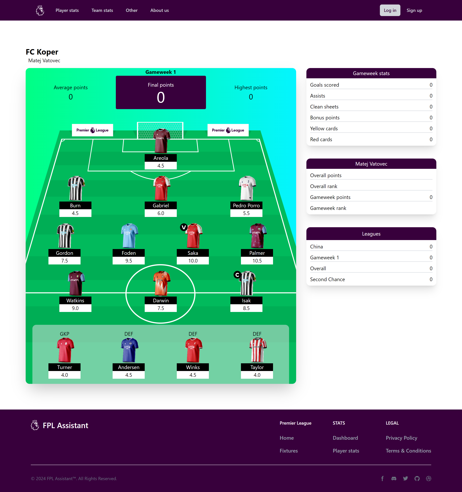

# FPL Assistant

FPL Assistant is a simple Nuxt js application based on Vue js and Tailwind css. It uses client side rendering to visualize API calls to the official Fantasy Premier league API. The website was developed on a mobile-first architecture and features a responsive design. Some images of the application can be seen below:

